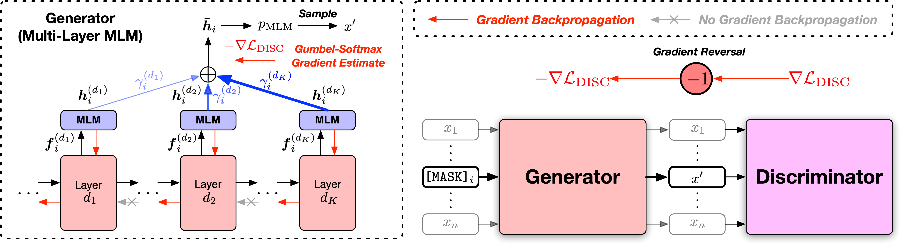

# AMOS

This repository contains the scripts for fine-tuning AMOS pretrained models on GLUE and SQuAD 2.0 benchmarks.

Paper: [Pretraining Text Encoders with Adversarial Mixture of Training Signal Generators](https://openreview.net/forum?id=sX3XaHwotOg)

</img>

## Overview

We provide the scripts in two versions, based on two widely-used open-source codebases, the [Fairseq Library](https://github.com/pytorch/fairseq) and the [Huggingface Transformers Library](https://github.com/huggingface/transformers). The two code versions are mostly equivalent in functionality, and you are free to use either of them. However, we note that the [fairseq](fairseq) version is what we used in our experiments, and it will best reproduce the results in the paper; the [huggingface](huggingface) version is implemented later to provide compatibility with the Huggingface Transformers Library, and may yield slightly different results.

Please follow the README files under the two directories for running the code.

## GLUE Fine-Tuning Results

The [General Language Understanding Evaluation (GLUE)](https://gluebenchmark.com/) benchmark is a collection of sentence- or sentence-pair language understanding tasks for evaluating and analyzing natural language understanding systems. 

GLUE dev set results of AMOS base++ model are as follows (median of 5 different random seeds):

| Model | MNLI-m/mm | QQP | QNLI | SST-2 | CoLA | RTE | MRPC | STS-B | AVG |
| ------ | ------ | ------ | ------ | ------ | ------ | ------ | ------ | ------ | ------ |
| AMOS base++ | 90.5/90.4 | 92.4 | 94.4 | 95.5 | 71.8 | 86.6 | 91.7 | 92.0 | 89.4 |

GLUE test set results of AMOS base++ model are as follows (no ensemble, task-specific tricks, etc.):

| Model | MNLI-m/mm | QQP | QNLI | SST-2 | CoLA | RTE | MRPC | STS-B | AVG |
| ------ | ------ | ------ | ------ | ------ | ------ | ------ | ------ | ------ | ------ |
| AMOS base++ | 90.4/89.9 | 90.2 | 94.6 | 96.8 | 69.2 | 83.6 | 88.9 | 91.3 | 88.1 |

## SQuAD 2.0 Fine-Tuning Results

[Stanford Question Answering Dataset (SQuAD)](https://rajpurkar.github.io/SQuAD-explorer/) is a reading comprehension dataset, consisting of questions posed by crowdworkers on a set of Wikipedia articles, where the answer to every question is a segment of text, or span, from the corresponding reading passage, or the question might be unanswerable. 

SQuAD 2.0 dev set results of AMOS base++ and large++ models are as follows (median of 5 different random seeds):

| Model | EM | F1 |
| ------ | ------ | ------ |
| AMOS base++ | 85.0 | 87.9 |

## Citation
If you find the code and models useful for your research, please cite the following paper:
```
@inproceedings{meng2022amos,
  title={Pretraining Text Encoders with Adversarial Mixture of Training Signal Generators},
  author={Meng, Yu and Xiong, Chenyan and Bajaj, Payal and Tiwary, Saurabh and Bennett, Paul and Han, Jiawei and Song, Xia},
  booktitle={International Conference on Learning Representations},
  year={2022}
}
```

## Contributing

This project welcomes contributions and suggestions.  Most contributions require you to agree to a
Contributor License Agreement (CLA) declaring that you have the right to, and actually do, grant us
the rights to use your contribution. For details, visit https://cla.opensource.microsoft.com.

When you submit a pull request, a CLA bot will automatically determine whether you need to provide
a CLA and decorate the PR appropriately (e.g., status check, comment). Simply follow the instructions
provided by the bot. You will only need to do this once across all repos using our CLA.

This project has adopted the [Microsoft Open Source Code of Conduct](https://opensource.microsoft.com/codeofconduct/).
For more information see the [Code of Conduct FAQ](https://opensource.microsoft.com/codeofconduct/faq/) or
contact [opencode@microsoft.com](mailto:opencode@microsoft.com) with any additional questions or comments.
